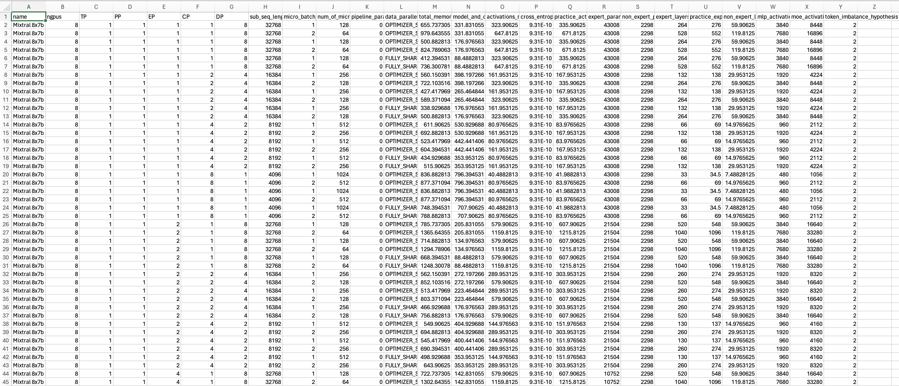

# model-parallel-search

## Install

```bash
pip install -r requirements.txt
```

## Usage

```bash
python parallel-search.py \
    --config-name Mixtral_8x7b.yaml \
    +ngpus_range="[8, 128, 1024, 10240]"
```


